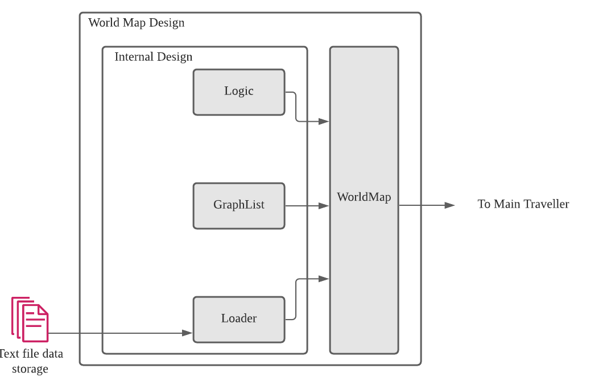
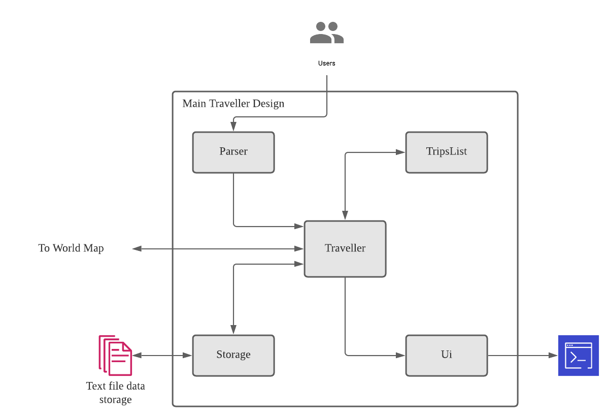

# Traveller Developer Guide

## Preface
Traveller is a travel planner app that is designed to help holidaymakers like you optimise your trips!
It is created for individuals who prefer to use a Command Line Interface (CLI) over a Graphical User Interface (GUI),
while still retaining the ease of use of a GUI.
Use Traveller so that you can plan your trips with ease and focus on what matters most: Fun!

### Purpose of developer guide
This developer guide is for developers of Traveller and documents the structure and implementation of Traveller.
Developers are recommended to read this guide to understand the code architecture of Traveller before contributing to
the application.

Use the Table of Contents below to easily navigate to the section you desire.

### Legend

|Icon|Explanation|
|:---:|:---:|
||Shows how this developer guide is formatted.|
||Shows useful tips when developing Traveller.|
||Shows potential problems when developing Traveller.|

### Acknowledgements

{list here sources of all reused/adapted ideas, code, documentation, and third-party libraries -- include links to the original source as well}

---

## Table of Contents
* [1. Design & Implementation](#1-design--implementation)
  * [1.1. World Map](#11-world-map)
    * [1.1.1. `WorldMap` class](#111-worldmap-class)
    * [1.1.2. `GraphList` class](#112-graphlist-class)
    * [1.1.3. `Logic` class](#113-logic-class)
    * [1.1.4. `Loader` class](#114-loader-class)
  * [1.2. Main Traveller](#12-main-traveller)
    * [1.2.1. `Traveller` class](#121-traveller-class)
    * [1.2.2. `Parser` class](#122-parser-class)
    * [1.2.3. `TripsList` class](#123-tripslist-class)
    * [1.2.4. `Ui` class](#124-ui-class)
    * [1.2.5. `Storage` class](#125-storage-class)
* [2. Product Scope](#2-product-scope)
  * [2.1. Target User Profile](#21-target-user-profile)
  * [2.2. Value Proposition](#22-value-proposition)
* [3. User Stories](#3-user-stories)
* [4. Non-Functional Requirements](#4-non-functional-requirements)
* [5. Glossary](#5-glossary)
* [6. Instructions for Manual Testing](#6-instructions-for-manual-testing)

## 1. Design & Implementation
Traveller's design can be broken down into 2 main components: The World Map, and the Main Traveller code, 
as illustrated in figure 1 below.
The World Map is the part of the application that handles the calculation of the shortest distance between countries, 
while the Main Traveller code handles the interaction with users, and the general logic of the application.

Figure 1: Design Overview of Traveller

### 1.1. World Map
The World Map is 1 of the 2 major components of the Traveller project.
It implements a key feature of the application, which is to find the shortest travel path from 1 country to another.
As shown in figure 2, the World Map consists of 4 sub-components, the [`WorldMap`](#111-worldmap-class) class, 
[`GraphList`](#112-graphlist-class) class, [`Logic`](#113-logic-class) class, and [`Loader`](#114-loader-class) class.
Additionally, the World Map uses 2 other classes to pass data around, the `Country` class, and the `Distance` class.

Figure 2: Design of the World Map

These 4 sub-components are implemented to maintain an internal graph of countries and distances. Dijkstra's algorithm 
is then performed on this graph to obtain the shortest travel path from 1 country to another.

#### 1.1.1. WorldMap class
{TODO: Add details}

#### 1.1.2. GraphList class
{TODO: Add details}

#### 1.1.3. Logic class
{TODO: Add details}

#### 1.1.4. Loader class
{TODO: Add details}

### 1.2. Main Traveller
The Main Traveller is the other of the 2 major components of the Traveller project.
It implements the essential CRUD features of the application.
As shown in Figure 3 below, the Main Traveller consists of 5 sub-components: the Traveller class, Parser class, 
TripsList class, Ui class, and Storage class.
Additionally, the `Command` class is used to execute various actions in the various sub-components.

Figure 3: Design of the Main Traveller

Details of each of the sub-components can be found in the subsequent sub-sections.

#### 1.2.1. Traveller class
The main class of the whole project. The 2 major components of Traveller ([World Map](#11-world-map) and 
[Main Traveller](#12-main-traveller)) is initialized here. 
Sub-components of [Main Traveller](#12-main-traveller) is also initialized here.

The class has a run function which is called to run the whole application. The steps taken in each iteration of the run
function is detailed below.

1. User input is read by the `Ui`.
2. User input is passed to the `Parser` for processing to output an executable `Command`.
3. `Command` is executed.
4. Any errors associated with [Main Traveller](#12-main-traveller) will be caught here.
5. Repeat Steps 1 to 4.

#### 1.2.2. Parser class
The `Parser` class processes raw user input to return a `Command` object, which can be executed to execute the action
specified by the command.
It's main function is the `parse` function, which takes in a user input string obtained by a `Ui` object and output the 
`Command` object. Figure 4 below illustrates the code of the `parse` function via a sequence diagram.

Figure 4: Parser Sequence Diagram

The steps illustrated by Figure 4 is summarised below.
1. The `parse` command is called once per iteration of the main `run` loop in `Traveller`.
2. Based on the user input, `parse` calls a private `parseAbcCommand`, which parses the user input for each available
command.
3. `parseAbcCommand` returns a `Command` object, which is returned by `parse`.
4. This `Command` object can then be executed to perform actions on the state of Traveller, such as creating new trips, 
viewing trips, or deleting trips.
5. If there is an error encountered by `parse` when processing user input, a corresponding `TravellerException` will be
thrown.

#### 1.2.3. TripsList class
{TODO: Add details}

#### 1.2.4. Ui class
{TODO: Add details}

#### 1.2.5. Storage class
{TODO: Add details}

## 2. Product Scope
### 2.1. Target User Profile
* has a need to plan and manage trips and itineraries
* prefers desktop and CLI over apps and GUI
* can type fast

### 2.2. Value Proposition
* plans a trip where a direct flight is not available, giving the shortest route based on time
* manage trips and itinerary faster than a GUI based app

## 3. User Stories

|Version| As a ... | I want to ... | So that I can ...|
|--------|----------|---------------|------------------|
|v1.0|user|add a trip|
|v1.0|user|delete a trip|remove a trip that is no longer relevant|
|v1.0|user|view all trips and details|manage all my trips and details|
|v1.0|user|edit a trip|remove outdated details and add new details at the same time|
|v1.0|frequent traveller|create multiple trips and itineraries|plan multiple trips at once|
|v2.0|new user|have a help function|know at a glance all the functions and how to use them|
|v2.0|trip planner|add items in an itinerary according to time|plan a detailed trip|
|v2.0|trip planner|delete items in an itinerary|remove things that I won't be doing during the trip|
|v2.0|detailed planner|edit items in an itinerary|make quick changes to my trip itinerary|
|v2.0|user|change the criteria of shortest path|plan a trip according to time, distance, or price|

## 4. Non-Functional Requirements

1. Should work on any _mainstream OS_ as long as it has Java `11` installed.
2. Should be able to hold up to 100 trips without any noticeable lag.

_{More to be added}_

## 5. Glossary

* **CLI** - Command Line Interface
* **GUI** - Graphical User Interface
* **Mainstream OS** - Windows, Linux, Unix, macOS
* **CRUD** - Create, Read, Update, Delete

## 6. Instructions for manual testing

{To be added}
{Give instructions on how to do a manual product testing e.g., how to load sample data to be used for testing}
