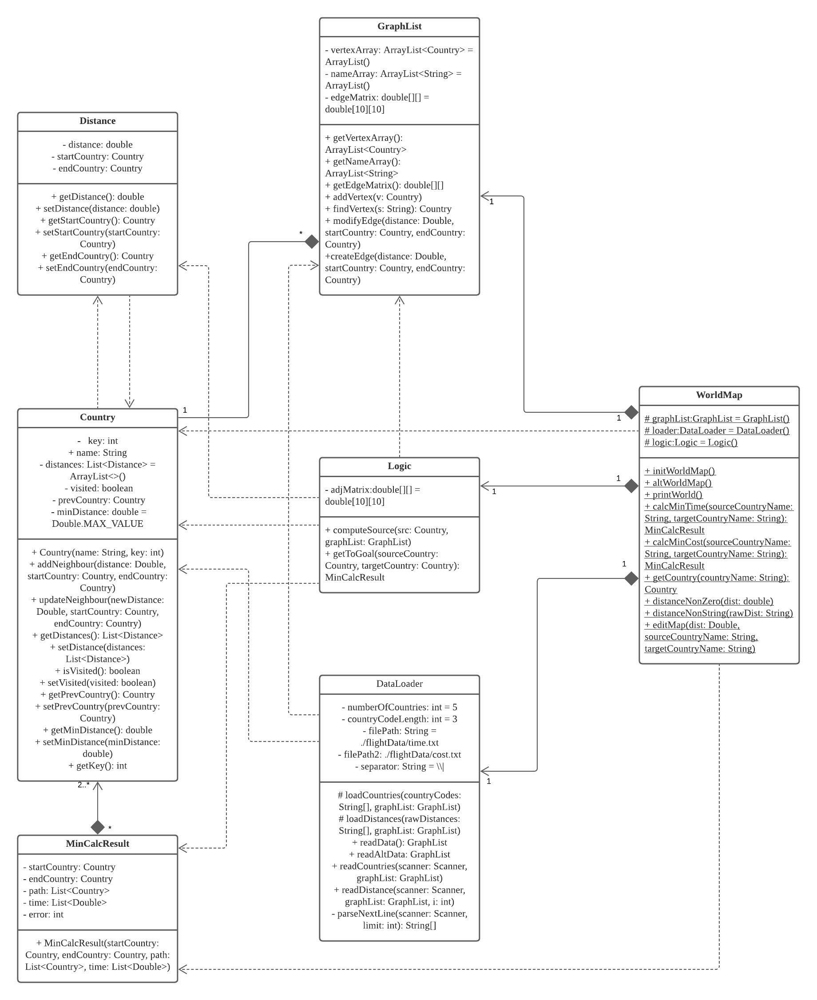
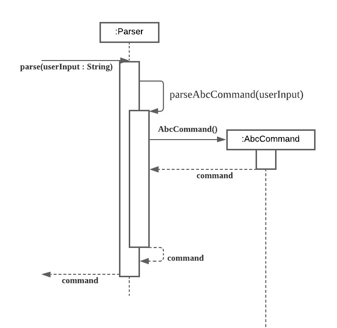
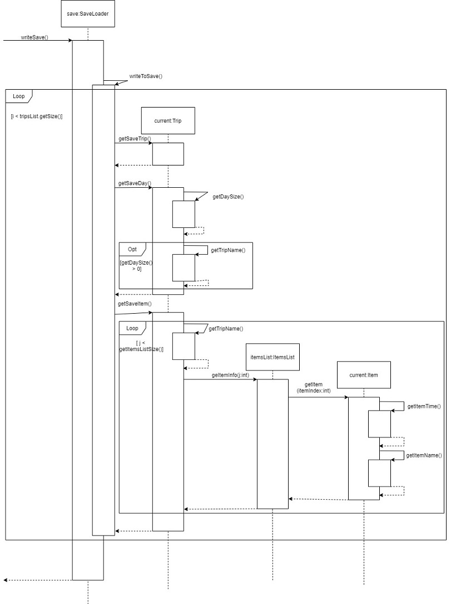

# Traveller Developer Guide


## Preface
Traveller is a travel planner app that is designed to help holidaymakers like you optimise your trips!

It is created for individuals who prefer to use a Command Line Interface (CLI) over a Graphical User Interface (GUI),
while still retaining the ease of use of a GUI.

Use Traveller so that you can plan your trips with ease and focus on what matters most: Fun!

### Purpose of developer guide
This developer guide is for developers of Traveller and documents the structure and implementation of Traveller.
Developers are recommended to read this guide to understand the code architecture of Traveller before contributing to
the application.

Use the Table of Contents below to easily navigate to the section you desire.

### Legend

|Icon|Explanation|
|:---:|:---:|
||Shows how this developer guide is formatted.|
||Shows useful tips when developing Traveller.|
||Shows potential problems when developing Traveller.|

---

## Table of Contents
* [1. Design & Implementation](#1-design--implementation)
  * [1.1. World Map](#11-world-map)
    * [1.1.1. `WorldMap` class](#111-worldmap-class)
    * [1.1.2. `GraphList` class](#112-graphlist-class)
    * [1.1.3. `Logic` class](#113-logic-class)
    * [1.1.4. `DataLoader` class](#114-dataloader-class)
  * [1.2. Main Traveller](#12-main-traveller)
    * [1.2.1. `Traveller` class](#121-traveller-class)
    * [1.2.2. `Parser` class](#122-parser-class)
    * [1.2.3. `TripsList` class](#123-tripslist-class)
    * [1.2.4. `Ui` class](#124-ui-class)
    * [1.2.5. `SaveLoader` class](#125-saveloader-class)
* [2. Product Scope](#2-product-scope)
  * [2.1. Target User Profile](#21-target-user-profile)
  * [2.2. Value Proposition](#22-value-proposition)
* [3. User Stories](#3-user-stories)
* [4. Non-Functional Requirements](#4-non-functional-requirements)
* [5. Glossary](#5-glossary)
* [6. Instructions for Manual Testing](#6-instructions-for-manual-testing)

## 1. Design & Implementation
Traveller's design can be broken down into 2 main components: The World Map, and the Main Traveller code, 
as illustrated in figure 1 below.
The World Map is the part of the application that handles the calculation of the shortest time/cost 
(collectively referred to as distance in this guide) between countries, 
while the Main Traveller code handles the interaction with users, and the general logic of the application.


<div style="text-align: center;">Figure 1: Design Overview of Traveller</div>

### 1.1. World Map
The World Map is 1 of the 2 major components of the Traveller project.
It implements a key feature of the application, which is to find the shortest travel path from 1 country to another.
As shown in figure 2, the World Map consists of 4 sub-components, the [`WorldMap`](#111-worldmap-class) class, 
[`GraphList`](#112-graphlist-class) class, [`Logic`](#113-logic-class) class, and [`DataLoader`](#114-dataloader-class) class.
Additionally, the World Map uses 2 other classes to pass data around, the `Country` class, and the `Distance` class.


<div style="text-align: center;">Figure 2: Design of the World Map</div>


These 4 sub-components are implemented to maintain an internal graph of countries and distances. Dijkstra's algorithm 
is then performed on this graph to obtain the shortest travel path from 1 country to another.

#### 1.1.1. WorldMap class
The `WorldMap` class is the main overarching class for the World Map component of the project. 
It instantiates all its subsequent classes, `GraphList`, `DataLoader`, and `Logic`. 

Its main functionalities are in the `calcMinDistance` function which calculates the least distance to get from a given source 
to destination country. Similarly, the `calcMinCost` function calculates the least cost. 
Then, the function then reads either *time.txt* or *cost.txt* and runs `computeSource` and `getToGoal`, 
both from the `Logic` class. Also, another key functionality is the `editMap` which is linked to the `Parser` class, 
which enables the user to edit a distance from a given source to destination country.

As a side note, `initWorldMap` initialises the main World Map which is based on distances, 
while `altWorldMap` boots up a side, read-only World Map based on the flight cost paths.     

`WorldMap` also throws various exceptions to ensure the distances and costs are updated in the correct format. 
For example, `distanceNonZero` and `distanceNonString` ensure the user's input is non-zero and is a number-type.

{TODO: Add diagram}

#### 1.1.2. GraphList class
The `GraphList` class is based off the `WorldMap` overarching class and translate it into a more simplistic graph 
format, namely referring to its components as vertices and edges.
It instantiates subsequent classes like `vertexArray` of Country type and `nameArray` of String type.

Its main functionalities are `addVertex` and `findVertex` which are then accessed by classes like `DataLoader` and 
`WorldMap`. 

Also, functions like `createEdge` link it to the Country class and calls the subsequent function `addNeighbour`, 
creating a bidirectional edge for both countries of interest. 
Similarly, the `modifyEdge` function calls the subsequent function `updateNeighbour` from the Country class. 
The list of distances are all stored in a matrix which is called by `getEdgeMatrix` by the `WorldMap` class.

{TODO: Add diagram}

#### 1.1.3. Logic class
The `Logic` class is the main class driving the logic from the overarching `WorldMap` class. 
Namely, it runs Dijkstra's algorithm on the given WorldMap.

This is done through both of its functionalities which need to be called together. 
`computeSource` runs Dijkstra's algorithm from the given starting country and 
expands outwards to all other countries, yielding the least distances to all other countries as well. 
Then, `getToGoal` backtracks from the target country to trace the shortest path to the source country, 
in reverse order. Note that `getToGoal` returns an object of `MinCalcResult` type.

#### 1.1.4. DataLoader class
The `DataLoader` class reads in data from *flightData/time.txt* or *flightData/cost.txt* to create the vertexes 
and edges in `GraphList`.
Its main function is the `readData` or `readAltData` function which passes the relevant lines in 
*time.txt* or *cost.txt* to either `loadCountries` or `loadDistances` to create vertexes or edges respectively.

While `DataLoader` is hardcoded to accept only 5 countries at its implementation, it is possible to increase this 
number by changing the variable `numberOfCountries` in the class. Reading on, `numberOfCountries` might be used as a
variable number.


<div style="text-align: center;">Figure 3: DataLoader Sequence Diagram</div>

The first line of *time.txt* or *cost.txt* contains the 5 country codes, which are read added as vertexes.
The remaining lines contain the country to country distances, which are in a lower triangular matrix, and are added as 
edges between the vertexes. The total number of lines in each text file is the same number as `numberOfCountries(5)`.

Each loop shown in the sequence diagram helps to facilitate the reading of the data 
according to how it is written in *time.txt* and *cost.txt*. 

1. The main loop ensures that only `numberOfCountries(5)` lines of text is read. 
2. The loop in `loadCountries()` ensures that only `numberOfCountries(5)` vertexes is added to the 
`graphList`. 
3. The loop in `loadDistances()` ensures that data is read as a lower triangular matrix of length 
`numberOfCountries - 1 (4)`, to ensure that duplicate edges are not added.

> Trivial points are omitted from the sequence diagram to keep it more concise.
> For example, getting the reference of `sourceCountry:Country` and `destinationCountry:Country` 
> from the `countryArray`. As well as the parsing of each newline read from `scanner` to ensure that the data is read
> properly. To read more about how data in *time.txt* and *cost.txt* is saved and thus parsed/read, 
> [click here](#61-data-file).

> As *time.txt* and *cost.txt* are both read in a specific way, 
> there are certain things to take note when modifying it.
>1. Country codes must only be 3 letters.
>2. Distances must be numbers as it will be parsed into a double.
>3. **numberOfCountries** should be changed to the number of countries on the first line.
>4. Total number of lines in both text files must be **numberOfCountries**.
> 
>  Invalid information that cannot be read by DataLoader will result in the 
> disregard of the entire text file.
> Please follow the format as stated above for [manual testing](#6-instructions-for-manual-testing).

### 1.2. Main Traveller
The Main Traveller is the other of the 2 major components of the Traveller project.
It implements the essential CRUD features of the application.
As shown in Figure 3 below, the Main Traveller consists of 5 sub-components: the Traveller class, Parser class, 
TripsList class, Ui class, and Storage class.
Additionally, the `Command` class is used to execute various actions in the various sub-components.


<div style="text-align: center;">Figure 4: Design of the Main Traveller</div>


Details of each of the sub-components can be found in the subsequent sub-sections.

#### 1.2.1. Traveller class
The main class of the whole project. The 2 major components of Traveller ([World Map](#11-world-map) and 
[Main Traveller](#12-main-traveller)) is initialized here. 
Sub-components of [Main Traveller](#12-main-traveller) is also initialized here.

The class has a run function which is called to run the whole application. The steps taken in each iteration of the run
function is detailed below.

1. User input is read by the `Ui`.
2. User input is passed to the `Parser` for processing to output an executable `Command`.
3. `Command` is executed.
4. Any errors associated with [Main Traveller](#12-main-traveller) will be caught here.
5. Repeat Steps 1 to 4.

#### 1.2.2. Parser class
The `Parser` class processes raw user input to return a `Command` object, which can be executed to execute the action
specified by the command.
It's main function is the `parse` function, which takes in a user input string obtained by a `Ui` object and output the 
`Command` object. Figure 4 below illustrates the code of the `parse` function via a sequence diagram.


<div style="text-align: center;">Figure 5: Parser Sequence Diagram</div>

The steps illustrated by Figure 4 is summarised below.
1. The `parse` command is called once per iteration of the main `run` loop in `Traveller`.
2. Based on the user input, `parse` calls a private `parseAbcCommand`, which parses the user input for each available
command.
3. `parseAbcCommand` returns a `Command` object, which is returned by `parse`.
4. This `Command` object can then be executed to perform actions on the state of Traveller, such as creating new trips, 
viewing trips, or deleting trips.
5. If there is an error encountered by `parse` when processing user input, a corresponding `TravellerException` will be
thrown.

#### 1.2.3. TripsList class
The `TripsList` class is the main class to store the data.
This include:

1.`Trip`.

2.`Day`.

3.`Item`.

It contains functions that can help control the date inside the list. 
`addTrip` function will create a new space and store the data in it, while the `deleteTrip` function will delete and 
clear the data from the list. `getTrip` and `getTripIndex` can return the specific `Trip` data by giving the name 
or the index of the Also, the `getSize` functions will return the size of the `TripsList`. 

{TODO: Add details}

#### 1.2.4. Ui class
The `Ui` class processes the interactions with users. The functions in `Ui` class will be called in `command` and then 
print messages in the interface.

{TODO: Add graft}
The steps illustated by Figure 6 is summarised now.
1. Run the `printWelcome` to greet the users.
2. Read user input and pass it to the `Parser`
3. Functions in `Ui` will be repeatedly called by `Command` class.

#### 1.2.5. SaveLoader class
The `SaveLoader` class handles the reading and writing of the save file which stores the existing trips when Traveller 
is exited.
It contains two main functions `readSave()` and `writeSave()`. While `readSave()` is called at the start of Traveller,
`writeSave()` is called whenever a command from user is received and executed, and when Traveller is exited.

> The function `writeSave()` is called whenever is command from user is received and
> executed to ensure that even if Traveller crashes due to unforeseen circumstances, the save data will always be up to
>  date. (Suggestion from [Issue #139](https://github.com/AY2122S1-CS2113T-W13-1/tp/issues/139).)

The save file in *save/save.txt* stores the minimum number of commands to recreate the same trip list that was 
saved previously.

Loading the save file is similar to the main `run` function of Traveller, as the function reads each line of 
*save.txt* and executes the corresponding command.

Following the loading of the save file, writing of the save file is handled as shown below.


<div style="text-align: center;">Figure 6: Save Sequence Diagram</div>

The functions `getSaveTrip()`, `getSaveDay()` and `getSaveItem()` return `strings` that corresponds to the 
command that will be executed in order to add a trip, day or item to the TripList, DaysList or ItemsList respectively.

> Trivial points are omitted from the sequence diagram to keep it more concise.
> To read up more on what the `SaveLoader` class writes, take a look at the `getSaveX` functions from the `Trip` class
> as shown in the diagram.
> 
>  Invalid commands that are in *save.txt* will be disregarded and not be 
> read/executed.
> This may result in other following commands to become invalid as well. (Eg. A previous existing trip not being 
> created due to an edited save.
> Resulting in days/items belonging to that trip becoming invalid.) As *SaveLoader* writes *save.txt* based on the 
> existing trips when Traveller is closed, invalid commands in *save.txt* will be deleted.

## 2. Product Scope
### 2.1. Target User Profile
* has a need to plan a trip
* want to optimise a flight
* would like to design detailed travel plans
* prefers desktop and CLI over apps and GUI
* is familiar with command line interface
* can type fast

### 2.2. Value Proposition
* plans a trip where a direct flight is not available, giving the shortest route based on time
* manage trips and itinerary faster than a GUI based app

## 3. User Stories

|Version| As a ... | I want to ... | So that I can ...|
|--------|----------|---------------|------------------|
|v1.0|user|add a trip|
|v1.0|user|delete a trip|remove a trip that is no longer relevant|
|v1.0|user|view all trips and details|manage all my trips and details|
|v1.0|user|edit a trip|remove outdated details and add new details at the same time|
|v1.0|frequent traveller|create multiple trips and itineraries|plan multiple trips at once|
|v2.0|new user|have a help function|know at a glance all the functions and how to use them|
|v2.0|trip planner|add items in an itinerary according to time|plan a detailed trip|
|v2.0|trip planner|delete items in an itinerary|remove things that I won't be doing during the trip|
|v2.0|detailed planner|edit items in an itinerary|make quick changes to my trip itinerary|
|v2.0|user|change the criteria of shortest path|plan a trip according to time, distance, or price|

## 4. Non-Functional Requirements

1. Should work on any _mainstream OS_ as long as it has Java `11` installed.
2. Should be able to hold up to 100 trips without any noticeable lag.

_{More to be added}_

## 5. Glossary

* **CLI** - Command Line Interface
* **GUI** - Graphical User Interface
* **Mainstream OS** - Windows, Linux, Unix, macOS
* **CRUD** - Create, Read, Update, Delete

## 6. Instructions for manual testing

### 6.1 Data file

The data file *flightData/time.txt* or *cost.txt* can be modified following the formatting stated [here](#114-dataloader-class).

To test out the effectiveness of the implemented algorithm, you can add 0 to the distance matrix to tell Traveller that
there is no flight between the two countries (no edge between the vertexes).

The lower triangular matrix is read as such.
```
SIN|MLY|CHN|JPN|SKR
1
2|3
4|5|6
7|8|9|10
```
Element11 (Row 1, Column 1) is the distance from SIN to MLY (and vice versa).

Element32 (Row 3, Column 2) is the distance from MLY to JPN (and vice versa).

### 6.2 Save file
The save file *save/save.txt* can be modified following the formatting stated [here](#125-saveloader-class) and the corresponding command formats
which can be found in our [UserGuide](https://ay2122s1-cs2113t-w13-1.github.io/tp/UserGuide.html).
